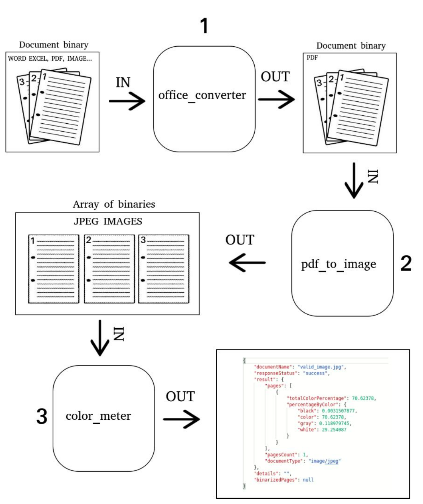
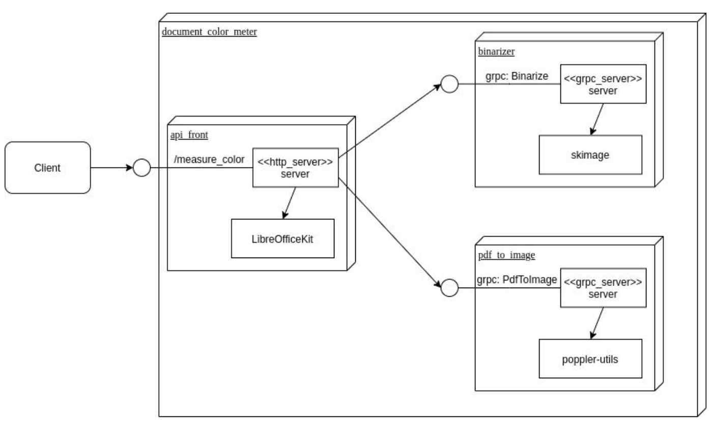
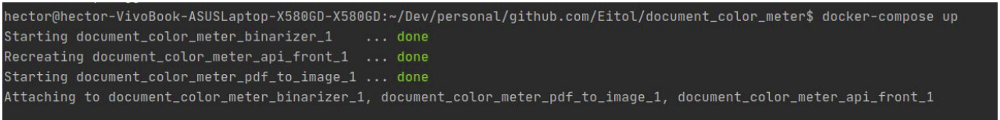

### Service to measure the amount of color in an image or document

You must see the spanish documentation in:

[./doc/document_color_meter.pdf](./doc/document_color_meter.pdf)


#### What does this software do?

#### INPUT:
 
An image or document 

Supported input formats:
- Image: JPEG, PNG, SVG
- Document: 
    - Word (doc, docx)
    - Excel (xls, xlsx)
    - PowerPoint (ppt, pttx)
    - OpenOffice/LibreOffice (odt)
    - PDF        


#### OUTPUT:

The measure of the color per each page

For example:

The next image contains equal content of black, color, gray and white:


Then the output is the next:

```json
{
    "documentName": "multicolor.png",
    "responseStatus": "success",
    "result": {
        "pages": {
            "1": {
                "totalColorPercentage": 25,
                "percentageByColor": {
                    "black": 25,
                    "color": 25,
                    "gray": 25,
                    "white": 25
                }
            }
        },
        "pagesCount": 1,
        "documentType": "image/png"
    },
    "details": "",
    "binarizedPages": null,
    "outPath": ""
}
```

To reproduce this do the following:
##### Step 1: Start the project
```bash
docker-compose up
```

##### Step 2: Do the request using curl (or postman) 
 
```bash
curl --location --request POST 'localhost:8080/measure_color' \
--form 'binarize=false' \
--form 'whiteThreshold=0' \
--form 'blackThreshold=0' \
--form 'grayThreshold=0' \
--form 'file=@github.com/Eitol/document_color_meter/api_front/core/test_util/testdata/multicolor.png'
```

Note: Change the path of the image

# Internal

### Flow
The detail of the flow is the next


### Architecture

The system is made up of 3 services. 
Expose an HTTP1 / JSON api

Internally it communicates with two gRPC services



#### How to run?


You should see an output like this:



